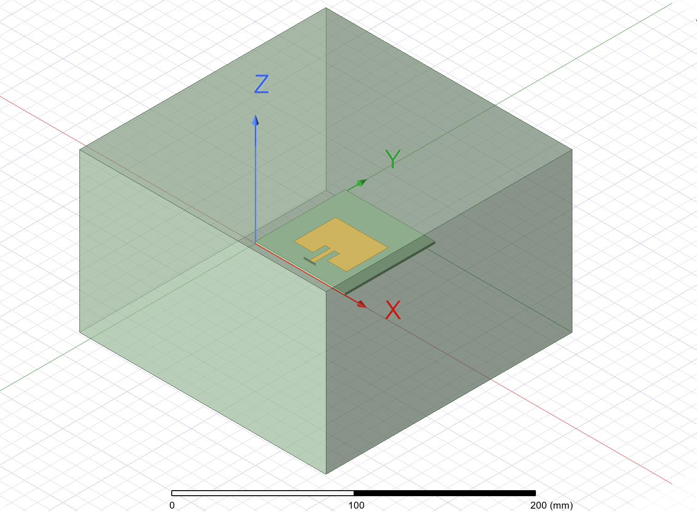
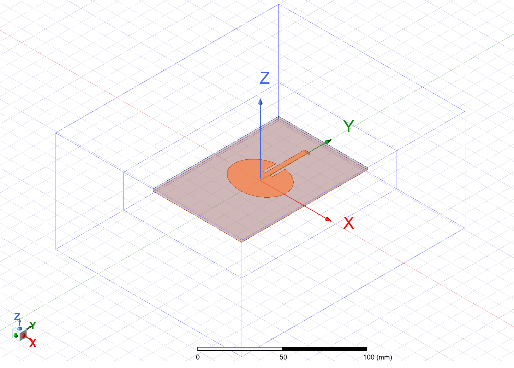
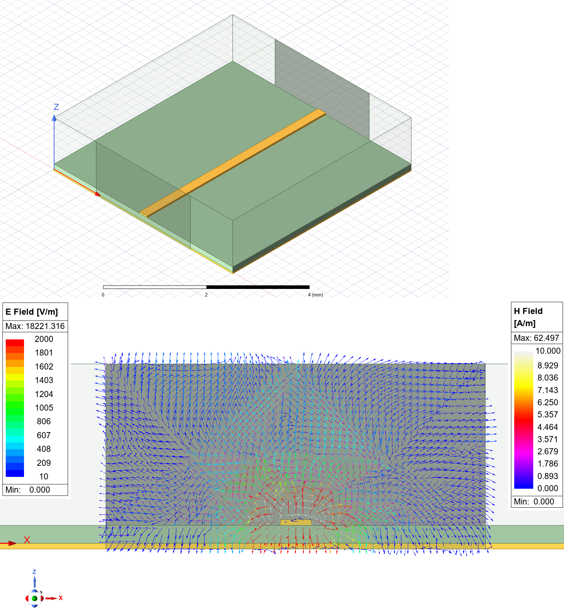
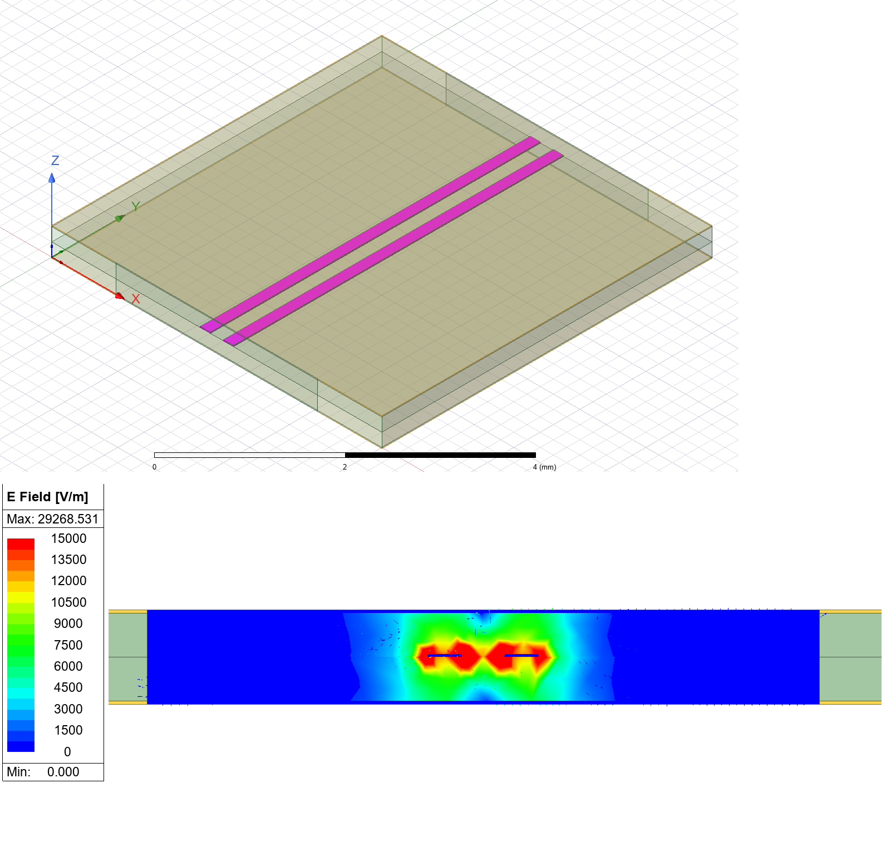
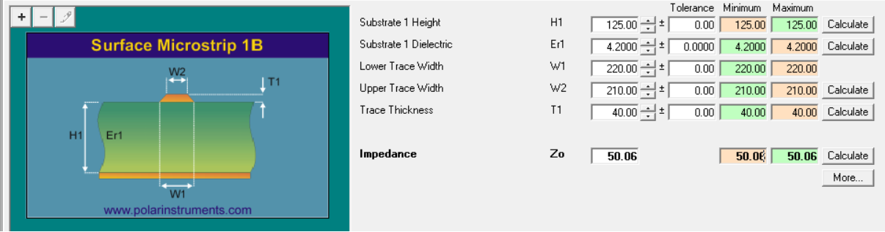
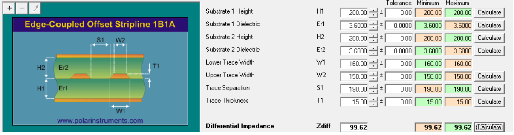
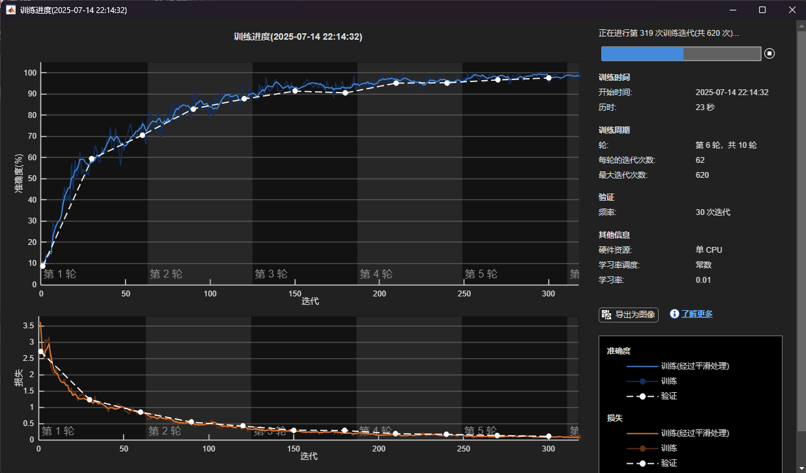

##  [Notes]  Feed Patch_antenna and Transmission Line
##  V 0.0.3  Initial Release (Correlation with VC measurement data)
##  [Date]  Aug 14, 2025
##  [Source] From Asenjo.HB.L design model at Beijing.
##  [Author's Email]  3405802009@qq.com
##  [Copyright]  Copyright Asenjo.HB.L . All rights reserved.







# Ketupa—v0.0.3

### Table of Contents
- [Introduction](#introduction)
- [Architecture](#architecture)
  - [Patch_antenna](#patch_antenna)
  - [Transmission_Line](#transmission_Line)
- [Installation](#installation)
  - [Torch](#torch)
  - [Dataset](#data-set)
- [Simulation](#simulation)
- [Next Steps](#next-steps)


# Introduction
This is a deep learning project applied to signal integrity and RF antenna design analysis.


# Architecture

## Patch_antenna

```
 ./Ketupa/simulation/Ansys_HFSS
   # Input
   -models
     - Wifi_patch_antenna.py
     - Edge_Fed_Rectangular_Patch_Antenna.py
     - Inset_Fed_Rectangular_Patch_Antenna.py
     - Planar_InvertedF_Antenna.py
     - Inset_Fed_Elliptical_Patch_Antenna.py
   -input_files
  
   # Output
   -HFSS_Projects
   -sim_results
     -  .bmp
     -  .csv
     -  .s1p
```

## Transmission_Line

Print the impedance calculated from Polar SI9000 into a .pdf file, export and save it in ./Ketupa/simulation/Ansys_HFSS_from_si9000/input_files/  path and rename to Surface_Sicrostrip_1B.pdf or Edge-Coupled_Offset_Stripline_1B1A.pdf.
```
 ./Ketupa/simulation/Ansys_HFSS_from_si9000
    # Input
   -models
     - Surface_Microstrip_1B.py
     - Edge-Coupled_Offset_Stripline_1B1A.py
     - …………
   -input_files
     - Surface_Microstrip_1B.pdf
     - Edge-Coupled_Offset_Stripline_1B1A.pdf
     - …………
     
   # Output
   -HFSS_Projects
   -sim_results
     -  .bmp
     -  .csv
     -  .s4p
   -logs
```


# Installation
 
Clone this repository:

```
git clone https://github.com/Shallot-2009/Ketupa.git
cd ./Ketupa/
```

Install PyTorch and other dependencies:

```
conda create -y -n [ENV] python=3.12
conda activate [ENV]
```


## Torch
```
### conda install -y pytorch=[>=1.6.0] torchvision cudatoolkit=[>=9.2] -c pytorch ###
### pip install torch==2.2.2 torchvision==0.17.2 torchaudio==2.2.2 --index-url https://download.pytorch.org/whl/cpu ###
```

## Data set
```
pip install -r requirements.txt
python main.py
```

Ansys hfss models:

```
cd ./Ketupa/simulation/Ansys_HFSS/models/
 python  Wifi_patch_antenna.py
#python Edge_Fed_Rectangular_Patch_Antenna.py
#python Inset_Fed_Rectangular_Patch_Antenna.py
#python Planar_InvertedF_Antenna.py
#python Inset_Fed_Elliptical_Patch_Antenna.py

or
cd ./Ketupa/simulation/Ansys_HFSS_from_si9000/models/
python Surface_Microstrip_1B
#python Edge-Coupled_Offset_Stripline_1B1A
```

Matlab:

```
cd ./Ketupa/matlab/
run s_read_files.m
```


# Simulation

```
cd ./Ketupa/simulation/Ansys_HFSS/models/
python Inset_Fed_Elliptical_Patch_Antenna.py
```

Output:


.bmp)


```
or
cd ./Ketupa/simulation/Ansys_HFSS_from_si9000/models/
python Surface_Microstrip_1B
```




```
or
cd ./Ketupa/simulation/Ansys_HFSS_from_si9000/models/
python Edge-Coupled_Offset_Stripline_1B1A
```



# Next Steps


Matlab CNN Test:




Auto_desk:

```
cd ..
python Auto_desk.py

Reference:
git clone https://github.com/microsoft/OmniParser.git
```